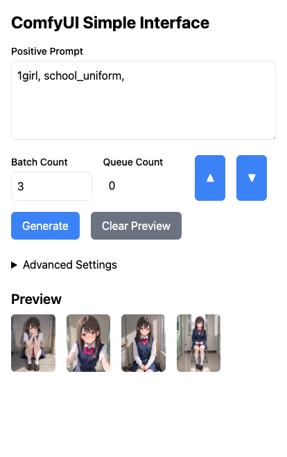

# ComfyUI Simple Interface

スマホからComfyUIを使いたいと思って作成されたシンプルなインターフェースです。



## 必要環境

- ComfyUI
- Bun
  - https://bun.sh/
  - JavaScriptおよびTypeScriptのランタイム環境で、Nodeよりも高速に動作します
- 以下のノードを事前にインストールする必要があります
  - [D2 Nodes ComfyUI](https://github.com/da2el-ai/D2-nodes-ComfyUI)
  - [D2 Send Eagle](https://github.com/da2el-ai/ComfyUI-d2-send-eagle)
  - [ComfyUI_tinyterraNodes](https://github.com/TinyTerra/ComfyUI_tinyterraNodes)

## インストールと実行方法

```
git clone https://github.com/da2el-ai/simple-comfyui.git
cd simple-comfyui
bun index.ts

Listening on http://localhost:3000
```

- `Listening on 〜` が表示されたら起動完了です
- ブラウザでアクセスして ComfyUI Simple Interface の画面が表示されれば成功です

### トラブルシューティング

画面が表示されない場合は、以下を確認してください：

- D2 Nodes ComfyUI 他、必要なカスタムノードがインストールされているか確認し、なければインストールしてください
- `config.json` の `comfyui_endpoint` を自分の環境のComfyUIのアドレスに合わせて設定してください
- `bun_port` は comfyui simple interface のポート番号です。通常は変更不要です

```json
{
    "bun_port": 3000,
    "comfyui_endpoint": "http://127.0.0.1:8188"
}
```

### タグ自動補完機能

- タグファイルを設置することで、入力中に自動補完が表示されるようになります
- 以下の手順で設定してください：
  1. [a1111-sd-webui-tagcomplete](https://github.com/DominikDoom/a1111-sd-webui-tagcomplete/blob/main/tags/danbooru.csv)からタグファイルをダウンロードします
  2. `simple-comfyui/dist/tags` フォルダを作成します
  3. ダウンロードした `danbooru.csv` を tags フォルダに置き、ファイル名を `autocomplete.csv` に変更します

## 使用方法

- `Positive Prompt` にプロンプトを入力し `Generate` ボタンを押すと生成が始まります。
- タグにカーソルを合わせた状態で `▲` / `▼` ボタンを押すとウェイトを調整できます
  - 選択範囲ではなく、カーソル位置のタグが対象となります
  - 複数タグの一括調整には対応していません
- `Batch Count`（生成枚数）は最大10枚に制限されています
- `Advanced Settings` からチェックポイントやサイズなどの詳細設定ができます
- `Workflow` メニューから別のワークフローに切り替えることができます
  - 初期状態では以下2種類のワークフローが同梱されています
    - simple_t2i: シンプルなtext2image生成。ComfyUI標準のSave Imageノードで保存します
    - simple_t2i_eagle: 画像管理ソフトEagleで画像を保存するためのワークフロー

## ワークフローのカスタマイズ

クオリティタグやステップ数、CFG値などを自分好みに変更するには、ワークフローまたはワークフロー設定の編集が必要です：

- ワークフロー
  - `simple-comfyui/dist/workflow/{ワークフロー名}.json`
  - ComfyUIのメニュー `Workflow > Export(API)` から保存したファイル
- ワークフロー設定
  - `simple-comfyui/dist/workflow/{ワークフロー名}_config.yaml`
  - 使用するノードの名前、IDなどを記載したファイル
  - VisualStudioCode(vscode)などのエディタで編集します

### ワークフロー編集手順

例として `simple_t2i.json` を使用した場合：

1. `simple_t2i.json` を `my_workflow.json` という名前に変更
2. `simple_t2i_config.yaml` を `my_workflow_config.yaml` という名前に変更
3. ComfyUIに `my_workflow.json` をドラッグ＆ドロップ
4. ワークフローが再現されるので、クオリティタグやステップ数など自由に変更
5. ComfyUIのメニュー `Workflow > Export(API)` から保存
6. ダウンロードしたファイルで `simple-comfyui/dist/workflow/` にあるファイルを上書き

### ワークフロー設定編集のタイミング

以下のような場合に設定ファイルの編集が必要になります：
- ノードの構成を変更した場合
- Advanced Settingsに入力項目を追加したい場合

詳細な説明は省略しますので、既存の設定ファイルを参考に編集してください。

### 開発者向け注意事項

- `npm build` を実行すると `/public/` の内容が `/dist/public/` にコピーされます
- 同名のファイルがある場合は上書きされるので注意してください

## ライセンス

MIT
